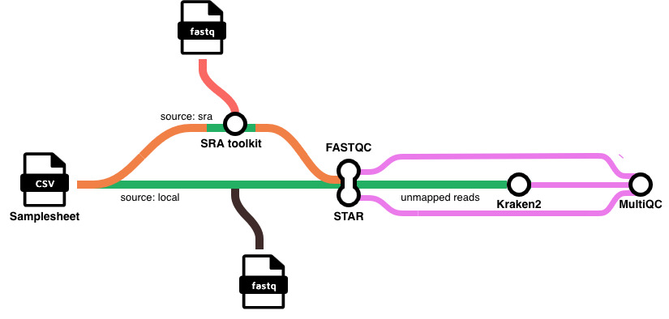

# nf-core/sepsismetagenomics

[](https://www.nextflow.io/)
[](https://github.com/nf-core/tools/releases/tag/4.0.2)


## Introduction

**nf-core/sepsismetagenomics** is a bioinformatics pipeline to identify pathogens in RNA-Seq samples from humans. It takes in a samplesheet with FASTQ files or SRA accession number (see below), downloads samples from SRA when needed, performs quality control, removes reads that align to the human genome using STAR, assigns taxonomic labels to the unmapped sequences using Kraken2, and performs MultiQC on each step. This pipeline follows analysis workflow recommended by [Lu, J. et al.](https://doi.org/10.1038/s41596-022-00738-y).



1. Download reads from SRA when `source == sra`([`SRAtoolkit`](https://github.com/ncbi/sra-tools/wiki/01.-Downloading-SRA-Toolkit))<br>
2. Read QC ([`FastQC`](https://www.bioinformatics.babraham.ac.uk/projects/fastqc/))<br>
3. Align reads to human genome using T2T reference([`STAR`](https://github.com/alexdobin/STAR))<br>
4. Assign taxonomic labels to unmapped reads([`Kraken2`](https://ccb.jhu.edu/software/kraken2/))<br>
5. Present QC for raw reads ([`MultiQC`](http://multiqc.info/))

#### Pipeline Input file
The pipeline takes in a csv file from `assets/samplesheet.csv` containing rows with four columns corresponding to: `sample_name,path_to_fastq_1,path_to_fastq_2,source` where: <br> <br>
`sample_name` = the name of the samples to be processed <br>
`path_to_fastq_1` = path to location of read 1 OR empty if source = `sra`<br>
`path_to_fastq_2` = path to location of read 2 if paired-end OR empty if single-ended <br>
`source` = local OR sra

Example input:
```
sample,fastq_1,fastq_2,source
SS_01, data/SS_01.fastq.gz,,local
SS_02, data/SS_02_R1.fastq.gz,data/SS_02_R2.fastq.gz,local
SRR0946912,,,sra
```

<!-- TODO nf-core:
   Complete this sentence with a 2-3 sentence summary of what types of data the pipeline ingests, a brief overview of the
   major pipeline sections and the types of output it produces. You're giving an overview to someone new
   to nf-core here, in 15-20 seconds. For an example, see https://github.com/nf-core/rnaseq/blob/master/README.md#introduction
-->

<!-- TODO nf-core: Include a figure that guides the user through the major workflow steps. Many nf-core
     workflows use the "tube map" design for that. See https://nf-co.re/docs/community/brand/workflow-schematics#examples for examples.   -->
<!-- TODO nf-core: Fill in short bullet-pointed list of the default steps in the pipeline --><br>.


## Usage

> [!NOTE]
> If you are new to Nextflow and nf-core, please refer to [this page](https://nf-co.re/docs/get_started/environment_setup/overview) on how to set-up Nextflow. Make sure to [test your setup](https://nf-co.re/docs/get_started/run-your-first-pipeline) with `-profile test` before running the workflow on actual data.

<!-- TODO nf-core: Describe the minimum required steps to execute the pipeline, e.g. how to prepare samplesheets.
     Explain what rows and columns represent. For instance (please edit as appropriate):

First, prepare a samplesheet with your input data that looks as follows:

`samplesheet.csv`:

```csv
sample,fastq_1,fastq_2
CONTROL_REP1,AEG588A1_S1_L002_R1_001.fastq.gz,AEG588A1_S1_L002_R2_001.fastq.gz
```

Each row represents a fastq file (single-end) or a pair of fastq files (paired end).

-->

Now, you can run the pipeline using:

```bash
nextflow run main.nf \
    -profile hipergator \
    --outdir results/ \
    -resume
```

> [!WARNING]
> Please provide pipeline parameters via the CLI or Nextflow `-params-file` option. Custom config files including those provided by the `-c` Nextflow option can be used to provide any configuration _**except for parameters**_; see [docs](https://nf-co.re/docs/running/run-pipelines#using-parameter-files).

## Credits

nf-core/sepsismetagenomics was originally written by Leslie Smith.

## Contributions and Support

If you would like to contribute to this pipeline, please see the [contributing guidelines](docs/CONTRIBUTING.md).

## Citations

References for the tools used by the pipeline can be found in the [`CITATIONS.md`](CITATIONS.md) file.

This pipeline uses code and infrastructure developed and maintained by the [nf-core](https://nf-co.re) community, reused here under the [MIT license](https://github.com/nf-core/tools/blob/main/LICENSE).

> **The nf-core framework for community-curated bioinformatics pipelines.**
>
> Philip Ewels, Alexander Peltzer, Sven Fillinger, Harshil Patel, Johannes Alneberg, Andreas Wilm, Maxime Ulysse Garcia, Paolo Di Tommaso & Sven Nahnsen.
>
> _Nat Biotechnol._ 2020 Feb 13. doi: [10.1038/s41587-020-0439-x](https://dx.doi.org/10.1038/s41587-020-0439-x).

